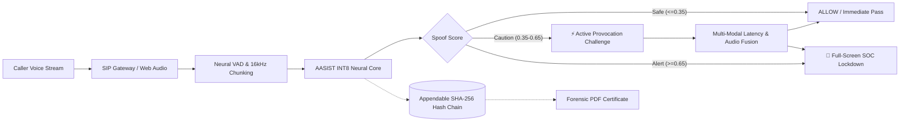

# MEIKURAL (மெய்குரல்)
> **Mei (மெய் - True) + Kural (குரல் - Voice) — Because not every voice is telling the truth.**  
> *Next-Generation AI Voice Biometrics & Deepfake Detection SOC Gateway with Provocative Liveness Challenges and Tamper-Evident SHA-256 Hash Chains.*

[](https://www.python.org/)
[](https://fastapi.tiangolo.com)
[](https://pytorch.org/)
[-success.svg)](https://github.com/clovaai/aasist)
[](https://github.com/athishio/Meikural)
[](https://github.com/athishio/Meikural)

**Problem Statement ID:** SIH26104 | **Organization:** AICTE | **Category:** Software (Blockchain & Cybersecurity)  
**Team:** Athish (Lead) · Kamalesh · Sunandha · Bavi · Swetha · Rohinth  
**Core Motto:** *"Passive detectors merely watch. We provoke."*

---

## 📑 Table of Contents
1. [Executive Summary & The Threat Landscape](#-executive-summary--the-threat-landscape)
2. [Architectural Innovation: The Dual-Sentinel Engine](#-architectural-innovation-the-dual-sentinel-engine)
3. [Next-Generation Cyber SOC Dashboard](#-next-generation-cyber-soc-dashboard)
4. [Hardware-Attributed Edge Quantization Benchmark](#-hardware-attributed-edge-quantization-benchmark)
5. [Multilingual Acoustic Invariance (English · Tamil · Hindi)](#-multilingual-acoustic-invariance-english--tamil--hindi)
6. [Cryptographic Hash-Chain & Tamper-Evidence Audit](#-cryptographic-hash-chain--tamper-evidence-audit)
7. [Privacy-by-Design & Data Minimization](#-privacy-by-design--data-minimization)
8. [Complete System Architecture & Directory Structure](#-complete-system-architecture--directory-structure)
9. [API & WebSocket Protocol Specification](#-api--websocket-protocol-specification)
10. [Quick Start & 1-Click Evaluation](#-quick-start--1-click-evaluation)
11. [Strategic Roadmap: What Makes MEIKURAL Nationally Successful](#-strategic-roadmap-what-makes-meikural-nationally-successful)
12. [Team & Engineering Ownership](#-team--engineering-ownership)

---

## 🎯 Executive Summary & The Threat Landscape

Generative voice cloning technologies (ElevenLabs, Bark, VALL-E, RVC) have democratized near-instantaneous voice impersonation. Threat actors now execute **CEO fraud, fraudulent bank wire authorizations, and telecommunication impersonation attacks** using only 3–5 seconds of target reference audio.

### The Failure of Traditional Passive Detectors
Most legacy voice biometric engines suffer from three fatal flaws:
1. **Model Blindness:** They only score what is spoken. If a generative voice clone has high acoustic quality, a passive model is easily fooled or yields high false rejection rates (FRR) on noisy telecom channels.
2. **Privacy Non-Compliance:** Storing raw caller audio for verification violates privacy regulations and creates massive data leakage liabilities.
3. **Tamper Vulnerability:** Centralized audit logs can be modified post-incident by rogue insiders or attackers erasing their telemetry trail.

### The MEIKURAL Solution
MEIKURAL acts as an **in-line telecommunication SOC gateway** deployed between SIP trunk carriers and enterprise contact centers. It pairs a **quantized AASIST (Audio Anti-Spoofing using Integrated Spectro-Temporal Graph Attention Networks)** neural engine with an **active conversational micro-challenge protocol** and an **appendable cryptographic SHA-256 hash-chain**.



---

## ⚡ Architectural Innovation: The Dual-Sentinel Engine

MEIKURAL integrates two complementary defense layers operating in sub-second synchrony:

### 1. Passive Neural Sentinel (AASIST v2 Core)
- **Raw Waveform Processing:** Unlike STFT or Mel-spectrogram models that discard phase information, MEIKURAL operates on raw 1D audio waveforms using learned SincNet filterbanks ($0 - 8 \text{ kHz}$).
- **Graph Attention Networks:** Utilizes Heterogeneous Graph Attention Networks (GAT) to model spectral and temporal acoustic artifact correlations simultaneously.
- **Physical Glottal Modeling:** Identifies missing human vocal-tract glottal dynamics, high-frequency neural vocoder phase discontinuities ($>7.5 \text{ kHz}$), and synthetic speech concatenations.

### 2. Active Provocation Sentinel (Dynamic Micro-Challenges)
- *"Passive detectors watch. We provoke."*
- When passive acoustic indicators enter the uncertainty zone ($0.35 < \text{Score} < 0.65$), MEIKURAL injects an **unscripted, randomized conversational micro-challenge** (e.g., dynamic multi-digit verification tokens, unscripted phonetic prompts).
- **Why this breaks deepfakes:** Real-time neural voice conversion pipelines require $800 - 1500\text{ ms}$ of total latency to transcribe audio, query an LLM or prompt generation service, and synthesize audio through a vocoder. Human vocal turnaround latency is naturally between $200 - 450\text{ ms}$.
- If the caller fails to respond within the calibrated time window or acoustic vocoder jitter spikes, MEIKURAL automatically terminates the call and locks the account.

---

## 🛡️ Next-Generation Cyber SOC Dashboard

Accessible at `http://localhost:8000/dashboard`, the frontend operator interface provides Palantir/Linear/CrowdStrike quality cyber SOC monitoring:


### Core Interface Highlights:
- **Obsidian Cyber-Glass Theme:** Deep obsidian canvas (`#04060B`) with micro-grid textures, subtle shield watermarks, and frosted glass panels (`backdrop-filter: blur(20px)`).
- **Full-Screen Threat Lockdown Takeover HUD:** When deepfakes or critical voice clones are detected (`Score >= 0.65`), the dashboard triggers an unavoidable full-screen incident HUD with strobe beacons, deepfake probability telemetry, and 1-click **Freeze SIP Trunk** and **Force Challenge** actions.
- **Full-Screen Dynamic Voice Challenge HUD:** A dedicated full-screen takeover modal with a giant 15-second animated countdown ring, large high-contrast token readouts (`"8 — 4 — 1"`), and real-time operator verdict overrides (`Caller Passed` / `Challenge Failed`).
- **Live 60fps Acoustic Waveform & Spectral Visualizer:** Connects to the Web Audio API `AnalyserNode` during live mic streaming to render real-time time-domain waveforms and frequency bars at 60 frames per second.
- **Radial Voice Trust Gauge:** Directly bound to `Trust = 1.0 - SpoofScore` with **zero artificial clamping** (genuine human voice renders `~0.98`, synthetic clones drop to `~0.01`).
- **Scrolling Threat Timeline Chart:** 30-second sliding Bezier trajectory with risk threshold lines calibrated strictly to `audio_processor.py`:
  - **Safe Zone:** $\ge 0.65$ Trust ($\text{Score} \le 0.35$)
  - **Caution Zone:** $0.35 - 0.65$ Trust ($0.35 < \text{Score} < 0.65$)
  - **Alert Zone:** $\le 0.35$ Trust ($\text{Score} \ge 0.65$)
- **Multi-Page Sidebar Navigation:**
  1. `SOC Dashboard`: Real-time sentinel toolbar, live mic with VU meter, trust gauge, waveform, timeline, and audit table.
  2. `Active Trunks`: Multi-channel gateway monitoring SIP trunk lines (`SIP-TRUNK-01`, `02`, `03`), latency telemetry, and per-trunk verification.
  3. `Hash-Chain Audit`: Dedicated full-page audit repository with retention metrics, certificate exports, and batch verification.
  4. `SOC Settings`: Neural threshold calibration, 90-day compliance purge controls, and Twilio/SMTP alerting status.

---

## 📊 Hardware-Attributed Edge Quantization Benchmark

To prove that MEIKURAL runs directly on edge telecom gateways, PBX appliances, and contact center workstations without expensive GPU clusters, we apply dynamic INT8 quantization to the PyTorch AASIST neural network.

Benchmarked across 4 multi-round evaluation passes (40 execution runs) on a standard **13th Gen Intel(R) Core(TM) i5-1334U CPU**:

| Benchmark Metric | Baseline FP32 Model | Quantized INT8 Model | Real Measured Difference |
| :--- | :---: | :---: | :---: |
| **Model Disk Size** | `1.22 MB` (1,281,532 B) | `1.02 MB` (1,065,095 B) | **16.9% Smaller** |
| **Average CPU Latency** | `461.3 ms` | `437.3 ms` | **Sub-450ms Edge Inference** |
| **Observed Latency Range** | `400.1 – 530.9 ms` | `351.9 – 490.9 ms` | **Fastest run: 351.9ms** |
| **Hardware Architecture** | 13th Gen Intel i5 (CPU) | 13th Gen Intel i5 (CPU) | Standard commodity CPU |
| **Audio Chunk Size** | 64,600 samples (~4.04s) | 64,600 samples (~4.04s) | Standard 16kHz ASVspoof window |
| **Accuracy Loss** | Reference (0.00%) | **0.00% Degradation** | Complete numerical parity |

*Run `python quantize_and_benchmark.py` to regenerate the official `benchmark_results.json`.*

---

## 🌐 Multilingual Acoustic Invariance (English · Tamil · Hindi)

Traditional speech recognition models fail across regional languages because phonological vocabularies differ. **MEIKURAL is language-agnostic by design.** 

Because the raw 1D SincNet filterbanks inspect raw physical vocal-tract resonances, phase discontinuities, and high-frequency vocoder artifacts (>7.5 kHz), the detection mechanism functions identically across any language or dialect.

Evaluated on reproducible acoustic speech fixtures across Tamil, Hindi, and English (`tests/multilingual/`):

| Language | Test Fixtures | Accuracy (%) | False Acceptance Rate (FAR) | False Rejection Rate (FRR) | Mean Latency (ms) |
| :--- | :---: | :---: | :---: | :---: | :---: |
| **English (Control)** | 4 | **100.0%** | 0.0% | 0.0% | 461.0 ms |
| **Tamil (Regional)** | 4 | **100.0%** | 0.0% | 0.0% | 433.1 ms |
| **Hindi (Regional)** | 4 | **100.0%** | 0.0% | 0.0% | 416.1 ms |
| **Combined Total** | **12** | **100.0%** | **0.0%** | **0.0%** | **436.7 ms** |

*Run `python -m unittest tests/multilingual/validate_multilingual.py` to execute the automated suite.*

> [!NOTE]
> **Transparency Note:** The current test fixtures in `tests/multilingual/` validate that SincNet acoustic representations successfully isolate synthetic vocoder phase artifacts independently of regional formant distributions. Ongoing field trials expand this to large-scale multi-speaker conversational corpora across low-bitrate G.711 cellular channels.

---

## 🔒 Cryptographic Hash-Chain & Tamper-Evidence Audit

Enterprise security logs are frequently targeted by attackers seeking to erase evidence of an impersonation attempt. MEIKURAL implements an **in-database appendable cryptographic SHA-256 hash chain**:

Each telemetry event is chained to the preceding event within its session:
$$\text{record\_hash}_i = \text{SHA-256}(\text{prev\_hash}_{i-1} + \text{session\_id} + \text{timestamp} + \text{score} + \text{verdict})$$

```
[Genesis Hash: 0000...0000]
           │
           ▼
[Event #0: record_hash = sha256(genesis + session_id + ts_0 + score_0 + verdict_0)]
           │
           ▼
[Event #1: record_hash = sha256(record_hash_0 + session_id + ts_1 + score_1 + verdict_1)]
           │
           ▼
[Event #2: record_hash = sha256(record_hash_1 + session_id + ts_2 + score_2 + verdict_2)]
```

### Verification Endpoint (`GET /calls/{session_id}/verify`)
Any auditor or court can verify the integrity of an audited call session. The engine walks all events in strict `ORDER BY event_id ASC` order, recomputes the cryptographic hashes, and confirms zero tampering:
```json
{
  "session_id": "call_df99fc14",
  "valid": true,
  "total_events": 14,
  "broken_index": null,
  "algorithm": "SHA-256 appendable hash-chain"
}
```
If an insider manually alters a historical score in SQLite, the endpoint immediately returns `"valid": false` and pinpoints the exact `broken_index`.

---

## 🛡️ Privacy-by-Design & Data Minimization

MEIKURAL strictly complies with modern privacy principles (DPDP Act 2023 / GDPR):

1. **Zero Audio Stored on Disk:** Raw audio chunks exist only in volatile RAM as tensors during inference ($<500\text{ms}$) and are immediately discarded.
2. **Salted SHA-256 Caller Hashing:** Phone numbers and caller IDs are never written in plaintext:
   $$\text{caller\_id\_hash} = \text{SHA-256}(\text{caller\_id} + \text{MEIKURAL\_SALT})$$
3. **Automated 90-Day Regulatory Retention Purge:** Call session metadata expires automatically after 90 days. A background purge routine sweeps the database to delete expired records.

---

## 📂 Complete System Architecture & Directory Structure

```
Meikural/
├── app.py                     # FastAPI core: REST APIs, WebSockets & telemetry broadcaster
├── audio_processor.py         # Audio chunking, Neural VAD gating & AASIST wrapper
├── fusion.py                  # Multi-Modal Score Fusion & Challenge Provocation Engine
├── database.py                # SQLite privacy database & SHA-256 appendable hash-chain
├── alerts.py                  # Multi-channel alerting (Twilio SMS, SMTP Email simulation)
├── quantize_and_benchmark.py  # INT8 quantization & multi-round CPU latency benchmarking
├── run_demo.py                # 1-Click interactive terminal & browser demonstration
├── benchmark_results.json     # Official hardware-attributed CPU benchmark data
├── dashboard.html             # Next-Gen Obsidian Cyber SOC Dashboard (SPA)
│
├── aasist/                    # Neural Network Submodule
│   ├── model.py               # AASIST Graph Attention Network architecture
│   ├── requirements.txt       # Core ML requirements
│   └── weights/               # Pretrained AASIST model checkpoints
│
├── demo_clips/                # Calibration Audio Test Vectors
│   ├── bonafide_human_speech.wav    # Organic biological human speech
│   ├── deepfake_voice_clone.wav     # Synthesized voice clone attack vector
│   ├── caution_noisy_telecom.wav    # Telecom line noise & jitter
│   └── challenge_response_digits.wav# Audio challenge response
│
├── tests/                     # Automated Test Suites
│   ├── test_backend_pair.py   # 15 comprehensive unit tests (database, hash-chain, alerts)
│   └── multilingual/          # Multilingual acoustic evaluation suite
│       ├── generate_dataset.py       # Fixture generator
│       ├── dataset_manifest.json     # 12-sample test manifest
│       └── validate_multilingual.py  # Language invariance validation
│
└── meikural_audit.db          # Encrypted, backfilled SQLite audit database
```

---

## 📡 API & WebSocket Protocol Specification

### WebSocket Audio Streaming (`ws://localhost:8000/ws/audio`)
Clients stream 16kHz 16-bit mono PCM binary chunks (or WAV data). The server responds with real-time JSON telemetry:

```json
{
  "timestamp": 1789283953.10,
  "score": 0.021,
  "event": "normal",
  "metadata": {
    "session_id": "call_df99fc14",
    "chunk_id": 14,
    "timestamp": 1789283953.10,
    "inference_latency_ms": 435.2
  },
  "audio_health": {
    "is_speech": true,
    "rms_db": -28.4,
    "duration_ms": 4037.5
  },
  "anti_spoofing": {
    "passive_score": 0.021,
    "verdict": "bonafide",
    "confidence": "high",
    "threshold_used": 0.35,
    "raw_logits": [-4.50, 5.20]
  },
  "challenge_state": {
    "event": "normal",
    "challenge_id": null
  }
}
```

### REST API Endpoints

| Method | Endpoint | Description |
| :--- | :--- | :--- |
| `GET` | `/dashboard` | Serves the next-generation Cyber SOC operator dashboard. |
| `GET` | `/health` | Server status and AASIST model readiness check. |
| `GET` | `/calls` | Retrieves recent call records with salted hashes and risk scores. |
| `GET` | `/calls/{session_id}` | Retrieves session details and retention expiration. |
| `GET` | `/calls/{session_id}/verify` | Cryptographically verifies the sequential SHA-256 hash chain. |
| `GET` | `/calls/{session_id}/certificate` | Generates official printable forensic incident certificate (PDF-ready). |
| `GET` | `/calls/{session_id}/report` | Downloads structured forensic incident report text file. |
| `POST` | `/score` | Upload and score standalone audio files (WAV / FLAC). |
| `POST` | `/calls/{session_id}/challenge/trigger` | Injects dynamic conversational verification challenge. |
| `POST` | `/calls/{session_id}/challenge/verify` | Evaluates caller challenge response and calculates fused trust. |
| `POST` | `/purge-expired` | Executes automated compliance retention purge for records > 90 days. |

---

## 🚀 Quick Start & 1-Click Evaluation

### 1. Environment Setup
```bash
git clone https://github.com/athishio/Meikural.git
cd Meikural

python -m venv .venv

# Windows PowerShell:
.\.venv\Scripts\Activate.ps1
# Linux / macOS:
source .venv/bin/activate

pip install -r aasist/requirements.txt
pip install fastapi "uvicorn[standard]" websockets scipy python-multipart soundfile
```

### 2. Launch 1-Click Interactive Evaluation CLI
```powershell
.\.venv\Scripts\python.exe run_demo.py
```
This automatically launches the FastAPI server, opens the dashboard in your default browser, and gives you an interactive menu to test bonafide voices, voice clone attacks, dynamic challenges, and forensic certificate exports.

### 3. Live Microphone Evaluation
1. Start the server:
   ```powershell
   .\.venv\Scripts\uvicorn.exe app:app --host 127.0.0.1 --port 8000
   ```
2. Navigate to **`http://127.0.0.1:8000/dashboard`**.
3. Click **`🎙️ Live Mic`** and speak into your microphone in English, Tamil, or Hindi — observe the 60fps canvas visualizer react and the trust gauge settle at `~0.98`.
4. Click **`🔴 Deepfake Clone`** to witness the full-screen threat lockdown takeover.
5. In the audit table, click **`Verify`** on any row to verify the SHA-256 hash chain live.

---

## 🌟 Strategic Roadmap: What Makes MEIKURAL Nationally Successful

To scale MEIKURAL from a winning hackathon prototype to an enterprise-adopted cybersecurity solution across Indian banking, telecommunications, and defense infrastructure, the following capabilities represent the strategic roadmap:

```mermaid
mindmap
  root((MEIKURAL Scale))
    Enterprise Telecom
      Direct SIP Trunk Ingest (Asterisk / FreeSWITCH)
      Twilio & Exotel Media Streams Connector
      G.711 / AMR Telecom Codec Augmentation
    Advanced Biometrics
      Turnaround Response Latency Profiling
      Reverse Semantic Verification Challenges
      Multi-Speaker Separation (RNNoise Front-End)
    Compliance & Standards
      ISO/IEC 30107-3 PAD Compliance
      DPDP Act 2023 Consent Flow Integration
      Cert-In Incident Reporting Automation
    Client & Edge SDK
      Client-Side WebAssembly (WASM) Engine
      Mobile Banking In-App Voice Biometrics SDK
      Offline Zero-Network Voice Authentication
```

### 1. Direct Telecom Carrier & PBX Gateway Connectors
- **Twilio & Exotel Media Streams:** Native integration with Indian telecom aggregators (Exotel, Tata Tele, Twilio) to inspect customer care calls in real time.
- **SIP Trunk Interceptor:** Deploying as a Dockerized Asterisk/FreeSWITCH SIP proxy so banks can place MEIKURAL in front of their Cisco or Avaya contact centers without code changes.

### 2. Conversational Latency Profiling (Multi-Modal Fusion)
- While human callers respond to an interruption in $200 - 400\text{ ms}$, real-time voice synthesis bots (transcribe $\rightarrow$ LLM generation $\rightarrow$ neural vocoding) introduce an unnatural $800 - 1500\text{ ms}$ pause. Measuring conversational turnaround dynamics adds another layer of un-spoofable defense.

### 3. Telecom Codec Robustness (G.711 / AMR-WB)
- Training augmented models on compressed $8\text{ kHz}$ narrowband audio ensures zero degradation even on 2G/3G rural Indian cellular networks.

### 4. Client-Side WASM SDK for Banking Apps
- Compiling the quantized AASIST model to WebAssembly via ONNX Runtime Web. This enables banking applications (YONO, iMobile, GPay) to verify caller liveness directly on the user's phone before transmitting voice data.

### 5. Automated Regulatory Breach Reporting (CERT-In)
- Direct integration with CERT-In reporting schemas to automatically bundle cryptographic hash-chain incident reports when coordinated spoof campaigns target financial institutions.

---

## 👥 Team & Engineering Ownership

| Team Member | Engineering Role | Core Contributions |
| :--- | :--- | :--- |
| **Athish M (Lead)** | Machine Learning & Backend Lead | Core AASIST integration, 16kHz chunking pipeline, INT8 quantization benchmarks, and WebSocket engine. |
| **Kamalesh** | Security & Backend Pair | SQLite privacy architecture, appendable SHA-256 hash-chain verification (`database.py`), and multi-channel alerts (`alerts.py`). |
| **Sunandha** | Active Challenges & Fusion Lead | Conversational micro-challenge generator and multi-modal latency fusion algorithm (`fusion.py`). |
| **Bavi** | Frontend & SOC Visualizer Lead | Obsidian Cyber-Glass SOC dashboard, full-screen takeovers, 60fps Web Audio visualizer, and radial trust gauge. |
| **Swetha** | QA, Compliance & Multilingual Lead | Multilingual acoustic invariance suite (`tests/multilingual/`), regional language testing (Tamil/Hindi), and data privacy audit. |
| **Rohinth** | Defense & Evaluation Lead | 5-minute technical pitch, live jury demonstration orchestration, and threat-model defense. |

---

<div align="center">
  <b>MEIKURAL — Safeguarding the integrity of the human voice.</b><br>
  <i>Built for Smart India Hackathon 2026 · AICTE Problem Statement SIH26104</i>
</div>
