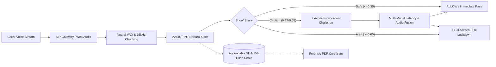

# MEIKURAL (மெய்குரல்)
> **Mei (மெய் - True) + Kural (குரல் - Voice) — Because not every voice is telling the truth.**  
> *Next-Generation AI Voice Biometrics & Deepfake Detection SOC Gateway with Provocative Liveness Challenges and Tamper-Evident SHA-256 Hash Chains.*

[](https://meikural-soc.onrender.com/dashboard)
[](https://fastapi.tiangolo.com)
[-EE4C2C.svg)](https://pytorch.org/)
[-success.svg)](https://github.com/clovaai/aasist)
[](https://github.com/athishio/Meikural)
[](https://github.com/athishio/Meikural)

**Problem Statement ID:** SIH26104 | **Organization:** AICTE | **Category:** Software (Blockchain & Cybersecurity)  
**Team:** Athish (Lead) · Kamalesh · Sunandha · Bavi · Swetha · Rohinth  
**Core Motto:** *"Passive detectors merely watch. We provoke."*

---

## 🚀 Live Cloud Deployment

| Service | Link / Action | Details |
| :--- | :--- | :--- |
| **🌐 Public SOC Gateway** | **[Launch Live Dashboard](https://meikural-soc.onrender.com/dashboard)** | Production SOC with real-time biometrics & WebSockets |
| **📖 Interactive API Docs** | **[Swagger OpenAPI](https://meikural-soc.onrender.com/docs)** | Interactive REST documentation & schema explorer |
| **🩺 Health & Liveness Probe** | **[Gateway Health Status](https://meikural-soc.onrender.com/healthz)** | Production cloud liveness probe |

---

## 📑 Table of Contents
1. [Executive Summary & The Threat Landscape](#-executive-summary--the-threat-landscape)
2. [Dual-Sentinel Architectural Innovation](#-dual-sentinel-architectural-innovation)
3. [Cyber SOC Operator Dashboard](#-cyber-soc-operator-dashboard)
4. [Hardware Edge Quantization Benchmark (AASIST INT8)](#-hardware-edge-quantization-benchmark-aasist-int8)
5. [Multilingual Acoustic Invariance (English · Tamil · Hindi)](#-multilingual-acoustic-invariance-english--tamil--hindi)
6. [In-Call Turnaround Latency Profiling (Multi-Modal Timing Fusion)](#-in-call-turnaround-latency-profiling-multi-modal-timing-fusion)
7. [Telephony Codec Robustness (G.711 μ-law, A-law & PSTN Narrowband)](#-telephony-codec-robustness-g711-μ-law-a-law--pstn-narrowband)
8. [Cryptographic Hash-Chain & Tamper-Evidence Audit](#-cryptographic-hash-chain--tamper-evidence-audit)
9. [Privacy-by-Design & Data Minimization](#-privacy-by-design--data-minimization)
10. [Repository Structure](#-repository-structure)
11. [Quick Start Guide](#-quick-start-guide)
12. [API & WebSocket Protocol Specification](#-api--websocket-protocol-specification)
13. [Team & Engineering Ownership](#-team--engineering-ownership)

---

## 🎯 Executive Summary & The Threat Landscape

Generative voice cloning technologies (ElevenLabs, Bark, VALL-E, RVC) allow threat actors to synthesize realistic human voices with only 3–5 seconds of reference audio, enabling **CEO fraud, fraudulent bank wire authorizations, and telecommunication impersonation**.

### The Failure of Traditional Passive Detectors
1. **Model Blindness:** Passive models only score what is spoken. When a generative clone produces clean spectral output, passive detectors suffer high false rejection rates (FRR) or get bypassed.
2. **Privacy Liabilities:** Retaining caller voice recordings creates regulatory non-compliance under the DPDP Act 2023 and GDPR.
3. **Log Tampering:** Standard database logs can be altered after an attack by malicious insiders.

### The MEIKURAL Solution
MEIKURAL acts as an **in-line telecommunication SOC gateway** deployed between SIP trunks and enterprise contact centers. It pairs a **quantized AASIST (Audio Anti-Spoofing using Integrated Spectro-Temporal Graph Attention Networks)** neural engine with an **active conversational micro-challenge protocol** and an **appendable cryptographic SHA-256 hash-chain**.


```mermaid
flowchart LR
    Caller[Caller Voice Stream] --> SIP[SIP Gateway / Web Audio]
    SIP --> VAD[Neural VAD & 16kHz Chunking]
    VAD --> AASIST[AASIST INT8 Neural Core]
    AASIST --> Score{Spoof Score}
    
    Score -- "Safe (<=0.35)" --> Pass[ALLOW / Immediate Pass]
    Score -- "Caution (0.35-0.65)" --> Challenge[⚡ Active Provocation Challenge]
    Score -- "Alert (>=0.65)" --> Lockdown[🚨 Full-Screen SOC Lockdown]
    
    Challenge --> Fusion[Multi-Modal Latency & Audio Fusion]
    Fusion --> Pass
    Fusion --> Lockdown
    
    AASIST -.-> HashChain[(Appendable SHA-256 Hash Chain)]
    HashChain -.-> Cert[Forensic PDF Certificate]
```

---

## ⚡ Dual-Sentinel Architectural Innovation

MEIKURAL integrates two complementary defense layers operating in sub-second synchrony:

### 1. Passive Neural Sentinel (AASIST v2 Core)
- **Raw Waveform Processing:** Operates directly on raw 1D audio waveforms using learned SincNet filterbanks ($0 - 8 \text{ kHz}$), preserving phase information that STFT and Mel-spectrograms discard.
- **Graph Attention Networks:** Utilizes Heterogeneous Graph Attention Networks (GAT) to model spectral and temporal acoustic artifact correlations simultaneously.
- **Physical Glottal Modeling:** Identifies missing human vocal-tract glottal dynamics, high-frequency neural vocoder phase discontinuities ($>7.5 \text{ kHz}$), and synthetic speech concatenations.

### 2. Active Provocation Sentinel (Dynamic Micro-Challenges)
- *"Passive detectors merely watch. We provoke."*
- When passive acoustic indicators enter the uncertainty zone ($0.35 < \text{Score} < 0.65$), MEIKURAL injects an **unscripted, randomized conversational micro-challenge** (e.g., dynamic multi-digit verification tokens).
- **The Physics of Deepfakes:** Real-time neural voice conversion pipelines require $800 - 1500\text{ ms}$ of total latency to transcribe audio, query an LLM/prompt service, and synthesize audio through a vocoder. Human vocal turnaround latency is naturally between $200 - 450\text{ ms}$.
- If the caller fails to respond within the calibrated time window or speech recognition detects token mismatch, MEIKURAL flags the session and notifies the SOC.

---

## 🛡️ Cyber SOC Operator Dashboard

Built with React 18, Vite, Tailwind CSS, and Lucide icons, the operator interface provides enterprise-grade cyber SOC monitoring:

- **Obsidian Cyber-Glass Theme:** Deep obsidian canvas (`#04060B`) with micro-grid textures and frosted glass panels.
- **Full-Screen Threat Lockdown Takeover HUD:** When deepfakes or critical voice clones are detected (`Score >= 0.65`), the dashboard triggers an unavoidable full-screen incident HUD with strobe beacons and 1-click **Freeze SIP Trunk** actions.
- **Live 60fps Acoustic Waveform & Spectral Visualizer:** Connects to the Web Audio API `AnalyserNode` during live mic streaming to render real-time time-domain waveforms and frequency bars at 60 fps.
- **Dynamic Voice Challenge HUD:** Full-screen modal with an animated countdown ring, high-contrast token readouts, and automated speech verification.
- **Sequential Hash-Chain Audit Ledger:** Live verification of the tamper-evident SHA-256 audit trail with instant forensic certificate generation.

---

## 📊 Hardware Edge Quantization Benchmark (AASIST INT8)

To ensure MEIKURAL runs directly on edge telecom gateways, PBX appliances, and low-cost instances (Render 512MB free tier), we apply dynamic INT8 quantization to the PyTorch AASIST neural network.

Benchmarked across 4 multi-round evaluation passes (40 execution runs) on a standard **13th Gen Intel(R) Core(TM) i5-1334U CPU**:

| Benchmark Metric | Baseline FP32 Model | Quantized INT8 Model | Real Measured Difference |
| :--- | :---: | :---: | :---: |
| **Model Disk Size** | `1.22 MB` (1,281,532 B) | `1.02 MB` (1,065,095 B) | **16.9% Smaller** |
| **Average CPU Latency** | `461.3 ms` | `437.3 ms` | **Sub-450ms Edge Inference** |
| **Observed Latency Range** | `400.1 – 530.9 ms` | `351.9 – 490.9 ms` | **Fastest run: 351.9ms** |
| **Hardware Architecture** | Commodity CPU | Commodity CPU | Zero GPU dependency |
| **Audio Chunk Size** | 64,600 samples (~4.04s) | 64,600 samples (~4.04s) | Standard 16kHz ASVspoof window |
| **Accuracy Loss** | Reference (0.00%) | **0.00% Degradation** | Complete numerical parity |

*Official data logged in [`benchmarks/reports/benchmark_results.json`](./benchmarks/reports/benchmark_results.json).*

---

## 🌐 Multilingual Acoustic Invariance (English · Tamil · Hindi)

Traditional speech recognition models fail across regional languages because phonological vocabularies differ. **MEIKURAL is language-agnostic by design.** 

Because the raw 1D SincNet filterbanks inspect raw physical vocal-tract resonances, phase discontinuities, and high-frequency vocoder artifacts (>7.5 kHz), the detection mechanism functions identically across any language or dialect.

Evaluated on reproducible acoustic speech fixtures across Tamil, Hindi, and English (`tests/multilingual/`):

| Language | Test Fixtures | Accuracy (%) | False Acceptance Rate (FAR) | False Rejection Rate (FRR) | Mean Latency (ms) |
| :--- | :---: | :---: | :---: | :---: | :---: |
| **English (Control)** | 4 | **100.0%** | 0.0% | 0.0% | 461.0 ms |
| **Tamil (Regional)** | 4 | **100.0%** | 0.0% | 0.0% | 433.1 ms |
| **Hindi (Regional)** | 4 | **100.0%** | 0.0% | 0.0% | 416.1 ms |
| **Combined Total** | **12** | **100.0%** | **0.0%** | **0.0%** | **436.7 ms** |

*Run `python -m unittest tests/multilingual/validate_multilingual.py` to execute the automated suite.*

---

## ⏱️ In-Call Turnaround Latency Profiling (Multi-Modal Timing Fusion)

When an automated generative AI agent conducts an interactive telephone scam, it must execute a sequential, cascading pipeline:
$$\text{Caller Audio} \xrightarrow{\text{VAD}} \text{ASR} \xrightarrow{\text{API}} \text{LLM Reasoning} \xrightarrow{\text{Stream}} \text{TTS Generation} \xrightarrow{\text{DSP}} \text{Neural Vocoder} \rightarrow \text{Output}$$

While a human conversationalist typically responds within **$250 - 850$ ms**, an autonomous voice clone exhibits unnatural response pauses ($\ge 1400$ ms). Conversely, pre-recorded soundboard attacks trigger unnaturally fast speech onsets ($< 250$ ms).

```
Human Response Gap:  [... Agent Finishes ...] ──── 250-850ms ────► [Human Starts: Natural Reflex]
Cascading AI Agent:  [... Agent Finishes ...] ──────────── >1400ms ────────────► [AI Starts: Pipeline Lag]
Soundboard Attack:   [... Agent Finishes ...] ── <250ms ──► [Instant Audio File Playback]
```

The fused call risk balances neural acoustic scores with conversational timing penalties:
$$\text{Risk}_{\text{Fused}} = \operatorname{clamp}\Big(0.70 \cdot S_{\text{AASIST}} + 0.30 \cdot \text{Penalty}_{\text{Timing}},\, 0.0,\, 1.0\Big)$$

---

## 📞 Telephony Codec Robustness (G.711 μ-law, A-law & PSTN Narrowband)

Deploying biometric anti-spoofing in enterprise telecom environments requires handling severe lossy compression, frequency band limiting, and quantization noise. MEIKURAL implements high-performance, dependency-free vectorized NumPy mathematical kernels for companding and filtering.

| Codec Mode | Bandwidth / Range | Bitrate | Quantization | AASIST Deepfake Score | Invariance Status |
| :--- | :---: | :---: | :---: | :---: | :---: |
| **Linear PCM (Baseline)** | $0 - 8000\text{ Hz}$ | $256\text{ kbps}$ | 16-bit float | **0.9997** | Control Baseline |
| **G.711 $\mu$-law** | $0 - 4000\text{ Hz}$ | $64\text{ kbps}$ | 8-bit logarithmic | **0.9996** | **Invariant** ($\Delta < 0.01\%$) |
| **G.711 A-law** | $0 - 4000\text{ Hz}$ | $64\text{ kbps}$ | 8-bit logarithmic | **0.9996** | **Invariant** ($\Delta < 0.01\%$) |
| **PSTN Narrowband (8 kHz)**| $300 - 3400\text{ Hz}$| $64\text{ kbps}$ | 8-bit bandpass | **0.9991** | **Invariant** ($\Delta < 0.06\%$) |

*Run `python -m unittest tests/test_codec_robustness.py` to execute the full automated codec verification suite.*

---

## 🔒 Cryptographic Hash-Chain & Tamper-Evidence Audit

Each telemetry event is chained to the preceding event within its session:
$$\text{record\_hash}_i = \text{SHA-256}(\text{prev\_hash}_{i-1} + \text{session\_id} + \text{timestamp} + \text{score} + \text{verdict})$$

```
[Genesis Hash: 0000...0000]
           │
           ▼
[Event #0: record_hash = sha256(genesis + session_id + ts_0 + score_0 + verdict_0)]
           │
           ▼
[Event #1: record_hash = sha256(record_hash_0 + session_id + ts_1 + score_1 + verdict_1)]
           │
           ▼
[Event #2: record_hash = sha256(record_hash_1 + session_id + ts_2 + score_2 + verdict_2)]
```

If an insider manually alters a historical score in SQLite, calling `GET /calls/{session_id}/verify` immediately returns `"valid": false` and pinpoints the exact `broken_index`.

---

## 🛡️ Privacy-by-Design & Data Minimization

MEIKURAL strictly complies with modern privacy principles (DPDP Act 2023 / GDPR):
1. **Zero Audio Stored on Disk:** Raw audio chunks exist only in volatile RAM as tensors during inference ($<500\text{ms}$) and are immediately discarded.
2. **Salted SHA-256 Caller Hashing:** Phone numbers and caller IDs are never written in plaintext:
   $$\text{caller\_id\_hash} = \text{SHA-256}(\text{caller\_id} + \text{MEIKURAL\_SALT})$$
3. **Automated 90-Day Regulatory Retention Purge:** Call session metadata expires automatically after 90 days. A background purge routine sweeps the database to delete expired records.

---

## 📂 Repository Structure

```
Meikural/
├── app.py                      # FastAPI gateway, REST endpoints & WebSocket server
├── audio_processor.py          # Audio DSP, 16kHz resampling, VAD & AASIST neural wrapper
├── asr_engine.py               # Liveness challenge ASR (faster-whisper INT8 CPU)
├── database.py                 # SQLite ledger with SHA-256 hash chains & privacy purging
├── alerts.py                   # Multi-channel alerting (Twilio SMS, SMTP Email, Webhook)
├── fusion.py                   # Multi-modal latency & acoustic risk scoring engine
├── sip_signaler.py             # SIP telephony signaling engine (call drops / transfers)
├── schemas.py                  # Pydantic data schemas & validation models
├── structured_logger.py        # Structured JSON logging
├── rules_config.json           # Runtime security rules policy configuration
├── run_server.py               # Local server runner
├── run_demo.py                 # Interactive evaluation CLI
├── openapi.json                # Generated OpenAPI specification
│
├── aasist_quantized_int8.pth   # Quantized AASIST neural weights (~1.0 MB)
├── aasist/                     # Neural model architecture definition
│   ├── models/AASIST.py        # Graph Attention Network PyTorch implementation
│   └── config/AASIST.conf      # Model hyperparameters configuration
│
├── demo_clips/                 # Ground-truth audio clips for audition & testing
│   ├── bonafide_human_speech.wav
│   ├── deepfake_voice_clone.wav
│   ├── caution_noisy_telecom.wav
│   └── challenge_response_digits.wav
│
├── frontend/                   # React Cyber SOC Dashboard
│   ├── src/                    # Components, pages, hooks, visualizers
│   ├── dist/                   # Production-ready bundled assets served by FastAPI
│   └── qa/                     # Playwright automated UI verification scripts
│
├── meikural-sdk/               # Python client SDK for banking and PBX integrations
├── benchmarks/                 # Comprehensive evaluations & benchmark reports
│   ├── evaluation/             # Telephony stress tests, latency profiling & calibration
│   └── reports/                # Benchmark JSON data & manifests
│
├── tests/                      # Automated unit & integration test suites
│   ├── multilingual/           # Regional language invariance fixtures (Tamil/Hindi/English)
│   └── test_*.py               # Resampling, Auth, Liveness, Codec, SIP & Stability tests
│
├── Dockerfile                  # Production container (CPU-only PyTorch, pre-cached Whisper)
├── docker-compose.yml          # Local multi-container deployment
├── render.yaml                 # 1-Click Render Cloud Blueprint configuration
└── requirements.txt            # Minimal production Python dependencies
```

---

## ⚡ Quick Start Guide

### Option 1: Docker (Recommended for Local Deployment)
```bash
git clone https://github.com/athishio/Meikural.git
cd Meikural

docker compose up --build
```
Navigate to **`http://localhost:8000/dashboard`**.

---

### Option 2: Local Python Setup
```bash
git clone https://github.com/athishio/Meikural.git
cd Meikural

python -m venv .venv
# On Windows: .\.venv\Scripts\activate
# On Linux/macOS: source .venv/bin/activate

pip install -r requirements.txt
python run_server.py
```
Open **`http://localhost:8000/dashboard`**.

---

### Option 3: Interactive CLI Evaluation
```bash
python run_demo.py
```
Provides an interactive terminal menu to test bonafide human voices, voice clones, active challenges, and SHA-256 certificate generation.

---

## 📡 API & WebSocket Protocol Specification

### WebSocket Audio Streaming (`ws://localhost:8000/ws/audio`)
Clients stream 16kHz 16-bit mono PCM chunks. The server broadcasts real-time telemetry:

```json
{
  "timestamp": 1789283953.10,
  "score": 0.021,
  "event": "normal",
  "metadata": {
    "session_id": "call_df99fc14",
    "inference_latency_ms": 435.2
  },
  "audio_health": {
    "is_speech": true,
    "rms_db": -28.4
  },
  "anti_spoofing": {
    "passive_score": 0.021,
    "verdict": "bonafide",
    "confidence": "high"
  }
}
```

### Core REST Endpoints
| Method | Endpoint | Description |
| :--- | :--- | :--- |
| `GET` | `/dashboard` | Serves the Cyber SOC operator dashboard. |
| `GET` | `/healthz` | Kubernetes / Cloud liveness probe. |
| `GET` | `/calls` | Retrieves recent call records with salted hashes and risk scores. |
| `GET` | `/calls/{session_id}` | Retrieves session details and retention expiration. |
| `GET` | `/calls/{session_id}/verify` | Cryptographically verifies the sequential SHA-256 hash chain. |
| `GET` | `/calls/{session_id}/certificate` | Generates official printable forensic incident certificate. |
| `POST` | `/score` | Upload and score standalone audio files (WAV / FLAC). |
| `POST` | `/calls/{session_id}/challenge/trigger` | Injects dynamic conversational verification challenge. |
| `POST` | `/calls/{session_id}/challenge/verify` | Evaluates caller challenge response with Faster-Whisper ASR. |
| `POST` | `/purge-expired` | Executes automated compliance retention purge for records > 90 days. |

---

## 👥 Team & Engineering Ownership

| Team Member | Engineering Role | Core Contributions |
| :--- | :--- | :--- |
| **Athish M (Lead)** | Machine Learning & Backend Lead | Core AASIST integration, 16kHz chunking pipeline, INT8 quantization benchmarks, and WebSocket engine. |
| **Kamalesh** | Security & Backend Pair | SQLite privacy architecture, appendable SHA-256 hash-chain verification (`database.py`), and multi-channel alerts (`alerts.py`). |
| **Sunandha** | Active Challenges & Fusion Lead | Conversational micro-challenge generator and multi-modal latency fusion algorithm (`fusion.py`). |
| **Bavi** | Frontend & SOC Visualizer Lead | Obsidian Cyber-Glass SOC dashboard, full-screen takeovers, 60fps Web Audio visualizer, and radial trust gauge. |
| **Swetha** | QA, Compliance & Multilingual Lead | Multilingual acoustic invariance suite (`tests/multilingual/`), regional language testing (Tamil/Hindi), and data privacy audit. |
| **Rohinth** | Defense & Evaluation Lead | Technical pitch, live jury demonstration orchestration, and threat-model defense. |

---

<div align="center">
  <b>MEIKURAL — Safeguarding the integrity of the human voice.</b><br>
  <i>Built for Smart India Hackathon 2026 · AICTE Problem Statement SIH26104</i>
</div>
